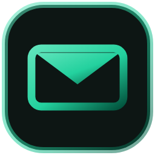
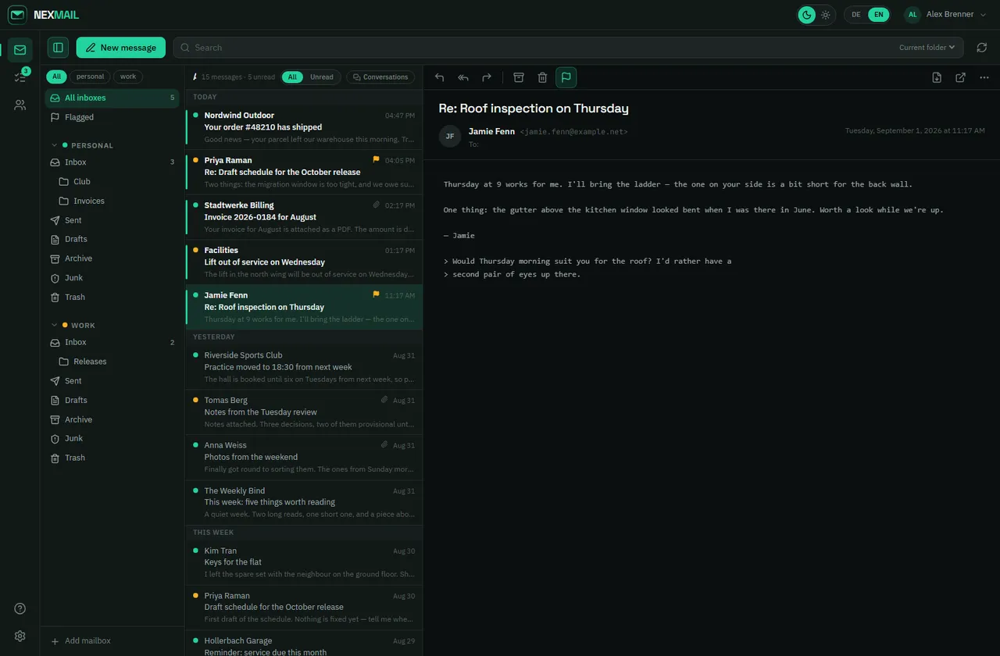
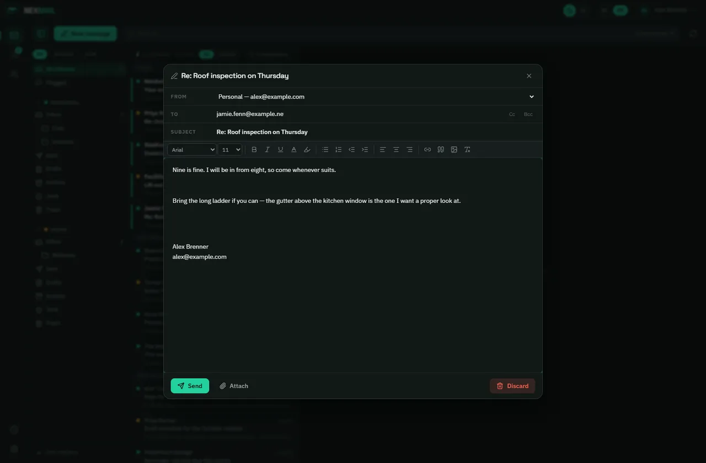
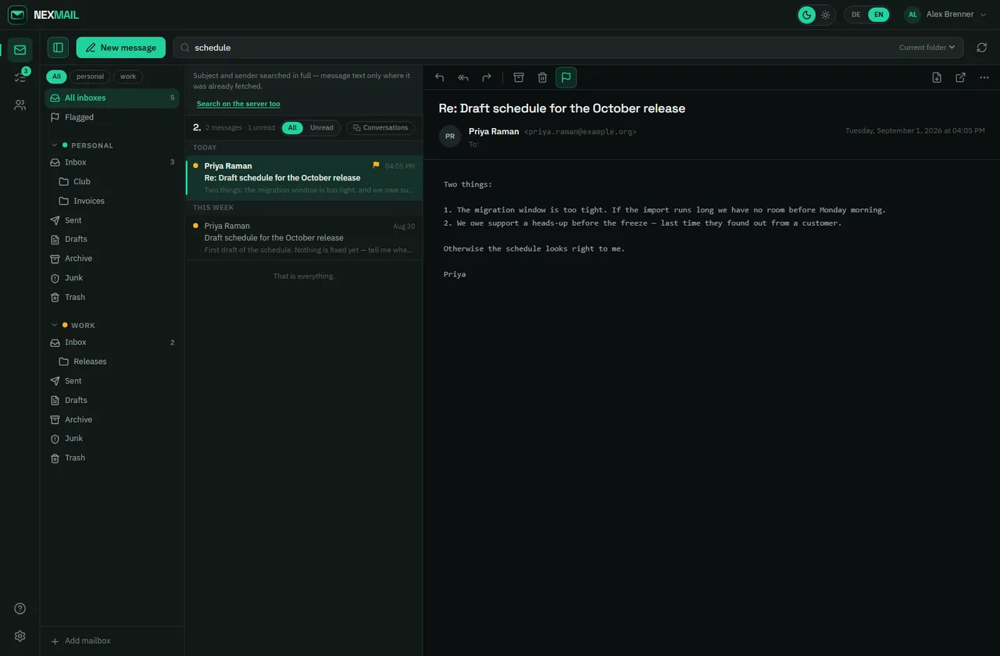
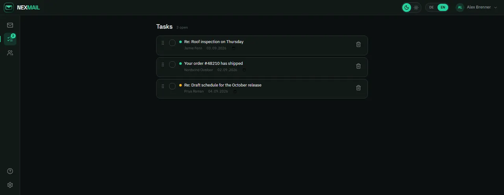
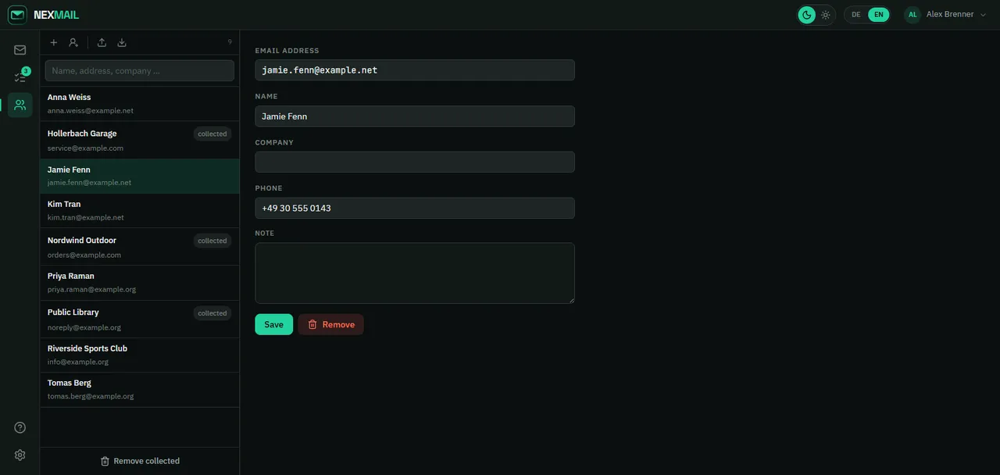
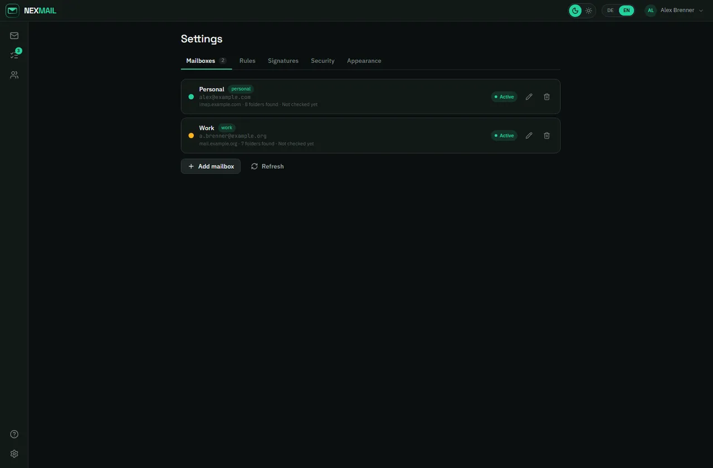
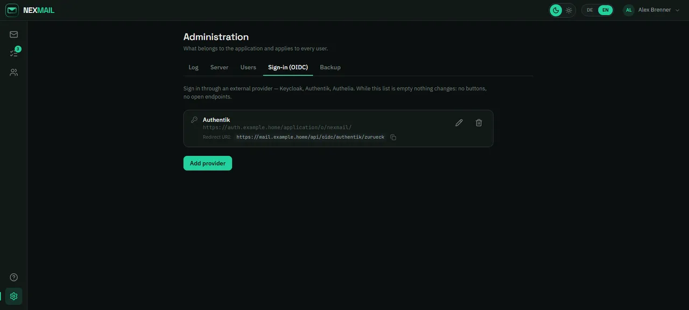
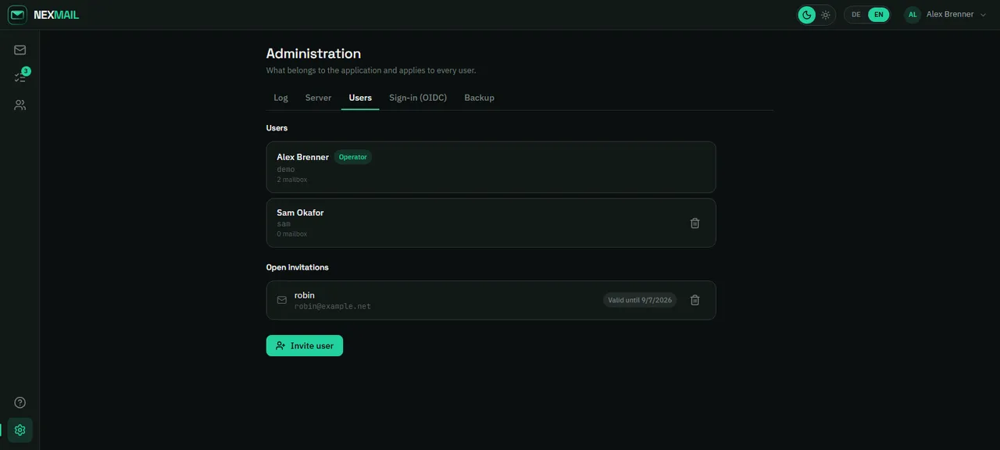
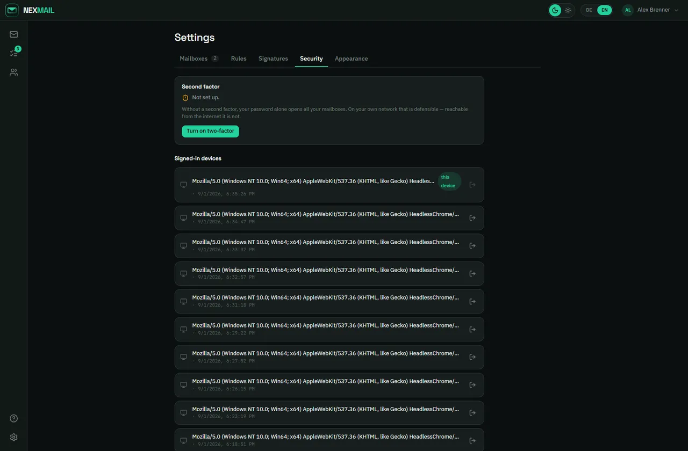

<div align="center">



# nexmail

**A self-hosted email client. One container, one file, your mailboxes stay with you.**

[Project site](https://nexmail.nexapps.dev) · [Report an issue](https://github.com/DerKezorm/nexmail/issues/new)

<picture>
  <source media="(prefers-color-scheme: light)" srcset="docs/screenshots/mail-hell-en.webp">
  
</picture>

</div>

---

nexmail brings several IMAP mailboxes together in one place and runs on your own
machine. It is meant for people who already host things at home: one container,
a single SQLite file, no second database, no cloud account, and no service that
gets to see your mail on the way.

Roundcube is webmail bolted onto one mailbox. Thunderbird does not run in a
browser. Commercial clients want to pull your mail onto their servers. nexmail
is the third option — and if you can use Outlook, you should feel at home.

> **Version 0.7.0.** It reads, writes, searches, sorts, labels, sends,
> schedules, prints, answers for you while you are away, keeps a calendar,
> backs itself up and can now reach you when the browser is closed. It is used
> daily by its author against real iCloud and IMAP mailboxes, and more than
> 1,200 automated tests watch over it — including 140 that drive a real browser
> against a real mailbox. It is still young: try it on a mailbox you can afford
> to have trouble with before you point it at the one that matters.

The screenshots below show a throwaway instance filled with invented mail.
Every address in them is under `example.com`, `example.org` or
`example.net`, which RFC 2606 reserves for exactly this purpose.

## What it does

**Mail.** Several mailboxes side by side, plus a merged *All inboxes* view.
Read, reply, reply-all, forward, move, archive, delete, mark, flag, undo. Drag
and drop between folders. Keyboard: `Del` to trash, `E` to archive.

**Conversations.** Related messages fold into one row — matched by the reply
chain first, subject only as a fallback and only when sender, subject and a
30-day window all agree. Off by default: grouping wrongly *hides* a message, and
you notice that at the worst possible moment.

**Writing.** A real formatting toolbar (Tiptap), attachments, pasted images,
drafts stored in the mailbox rather than in the browser, and an outbox that
survives a restart. Recipients become address bubbles as you type; nonsense
turns red instead of hiding inside a comma list. Set importance, get a
question when the text mentions an attachment that is not there, and forward
a message as an untouched `.eml` when someone needs the real thing.

**Send later, take it back.** Schedule a message for this evening, tomorrow
morning or any moment; it waits in nexmail's own outbox, visibly, and
cancelling files it as a draft. Undo send holds every outgoing message for a
few configurable seconds first — undo brings it straight back into the
compose window.



**Search.** Full-text over everything cached, plus `IMAP SEARCH` at the provider
on request. The interface says how far it looked — a search that hides its own
reach lets you conclude a message does not exist.



**Tasks.** Turn a message into a task, tick it off, drag it into order, give it
a due date. The task survives its message: if the mail is moved from your phone,
the task follows it by `Message-ID`; if the mail is deleted, the task stays and
says so.

**Contacts, rules, signatures.** An address book with vCard import and export
and collection from Sent; contact groups that expand into their members when
picked as a recipient; rules that run after each sync and only on new mail;
signatures per mailbox.

**Housekeeping.** Trash and junk can empty themselves after a number of days —
off by default, measured by how long a message has been in the folder, and
never touching a folder you created yourself. Printing produces a clean
document and goes straight to the print dialog. On a phone, swiping a row
archives or deletes, with the same undo as everywhere else.

| Tasks | Contacts |
|---|---|
|  |  |

**Mailbox groups.** Tag mailboxes (`personal`, `work`, `club`) and switch
between them above the folder tree.

**Labels.** Colour a message *Important*, *Work*, *Later*. They are stored as
IMAP keywords on the server, not in nexmail's database, so they outlive nexmail
and show up in Thunderbird and on your phone. Labels another client set appear
here too, with a name and a colour of their own.

**Follow-up.** Park a message until this evening, tomorrow or next week. It
moves into a real *Follow-up* folder on the server and comes back when it is
due — visible from every other client, not a note that only nexmail knows.

**Text templates.** The paragraphs you write again and again, kept once and
dropped into a message from the compose window.

**Out of office.** Per mailbox, with a period and a plain-text note. Every
sender gets it at most once; mailing lists, other automated systems and
delivery failures never get one, and mail that arrived before you left is not
answered retroactively. You can see who received one. Note that nexmail can
only answer while nexmail itself is running — your provider can usually do this
on the mail server, independently of it.

**Meeting invitations.** An `.ics` shows up as a card rather than an
unopenable attachment: title, time in your own time zone, place, organiser.
Accept, tentative or decline goes back as a proper reply, and nexmail remembers
what you answered. *Add to calendar* is a separate button on purpose: saying
yes tells the organiser you are coming, it does not mean you want the entry.

**Calendar.** Month, week and day, with your own calendars in nexmail or
connected over CalDAV to iCloud, Nextcloud or anything else that speaks it.
Google works too, through the same consent you gave for the mailbox. Recurring
events are stored once and worked out for the window on screen, so a *every
Monday* does not fill the database to the year 2031; *this one, this and
following, all* is asked the way every calendar asks it, because the format
leaves no other answer. A published `.ics` link can be subscribed to
read-only. What nexmail does not understand in a foreign event travels through
untouched: alarms, attendees and a dozen `X-APPLE-` properties come back out
the way they came in.

Reminders live on the event as a `VALARM`, so what you set here also goes off
on your phone. They reach you through the browser as well, with nexmail closed
— see *Notifications* below.

**Notifications.** nexmail can reach you with the browser closed: an event
reminder that falls due, and mail the sync actually just fetched. Every device
grants permission for itself; what you get notified about belongs to your
account and is the same everywhere. New mail is announced **after** the rules
have run, so a message a rule just filed into junk does not claim to be in your
inbox — and a mailbox's very first sync announces nothing, because at that
point every message is new. Quiet hours drop notifications rather than
deferring them: a reminder delivered at seven in the morning for an event at
eleven last night is not a reminder. On a phone this needs the site on the home
screen; iOS delivers nothing to an ordinary tab, and says nothing about why.

**Google and Microsoft mailboxes.** Both providers stopped accepting a
password for IMAP and SMTP, so nexmail signs in with OAuth. Two levels, kept
apart on purpose: the operator registers one app with the provider, every user
gives consent for their own mailbox. No secret ships with nexmail — the
repository is public, and both providers revoke a key they find in one, so
each operator registers their own. The administration page says so plainly
rather than letting you guess why nothing works.

**Moving between mailboxes.** Drag a message from one account to another.
`MOVE` and `COPY` only work inside one connection, so this fetches, appends at
the target, checks that it really arrived, and only then deletes at the source.
That order is the whole safety: the worst case is a message that exists twice,
which you can see and clean up.

**Moving in and out.** Import a Thunderbird `mbox`, or download a folder as
`mbox` or as a ZIP of `.eml` files. What is already there is skipped by
`Message-ID`, so an interrupted import can simply be repeated. Read and
flagged state travels both ways.

**HTML mail, defused.** Server-side sanitising with an allow-list, images
unhooked until you ask for them, and an iframe sandbox without scripts. The same
sanitising runs on what *you* write, on the way out.

When you do ask for the images, **nexmail's server fetches them, your browser
never does**. The sender learns that the message was opened, which is the price
of seeing the pictures in any client, but not your address, your browser or
anything else about you. Allow a sender for good with one click, or switch the
asking off entirely under *Appearance*. Addresses inside your own network are
refused: a message pointing at `http://192.168.x.x/reset` would otherwise make
the server a remote control for your home network.

## What it is not

* **No PGP or S/MIME.** Key management is a project of its own, and half-built
  encryption is worse than none.
* **No invitations of your own yet.** nexmail reads an invitation and answers
  it, but it cannot send one. Attendees on your own events are shown, not
  edited.
* **No Microsoft calendar.** Microsoft speaks no CalDAV; events there need the
  Graph API, which is a client of its own. Mail through IMAP and SMTP works.
* **No out-of-office reply while nexmail is down.** It answers only when the
  container runs. Your provider can usually do this on the server instead,
  independently of nexmail.

## Built with

FastAPI · SQLAlchemy · SQLite · React · Vite · Tailwind CSS · Tiptap · IMAPClient

One container. SQLite instead of Postgres is not a shortcut here, it is a
feature: no second container, no database credentials, and a backup is a copy.

## Running with Docker

```yaml
services:
  nexmail:
    image: ghcr.io/derkezorm/nexmail:latest
    container_name: nexmail
    restart: unless-stopped
    ports:
      - "5174:8000"
    volumes:
      - ./data:/data
    environment:
      PUID: 1000
      PGID: 1000
```

```bash
docker compose up -d
```

Then open `http://<server>:5174`. On first run you set a username and password.
After that, this route is closed.

> ⚠️ **Until the first account exists, anyone can create it.** There is no
> account that could authenticate at that point — it cannot work any other way.
> Set it up on your home network before you expose it.

The full compose file with every option and the reasoning behind each one is
[`docker-compose.yml`](docker-compose.yml) in this repository.

### Your mailbox credentials

nexmail asks for them **in its own interface and nowhere else**. You add
mailboxes under *Settings → Mailboxes*. They are stored encrypted and never
leave your server.



For iCloud you need an **app-specific password** from `account.apple.com`. Your
normal Apple password is refused, and iCloud reports that with the same message
it uses for a typo. nexmail says so in the connection test, so you do not spend
ten minutes doubting your password.

### What to back up

Everything is under `/data`:

| | |
|---|---|
| `nexmail.db` | mailboxes, messages, contacts, rules, sessions |
| `secret.key` | **the key to every stored mailbox password** |
| `blobs/` | attachments, stored by checksum |

> ⚠️ **`secret.key` and the database belong together.** Without the key the
> database is unreadable. With both, whoever holds them holds your mailboxes.

### Backup and restore

Under *Administration → Backup*. Two things live there, and telling them apart
matters when it counts:

**Restore points** are complete copies next to the database, made automatically
before any schema change and by hand whenever you want, on a schedule if you
like. They are for a failed update or a contact deleted by mistake. If the disk
dies, they die with it.

**A backup** is what you download: an encrypted ZIP, and deliberately **without
the messages**. Those are still in the mailbox on the server, and nexmail
fetches them back after a restore. Measured on a real database: 1890 messages
turn 0.36 MB into 2.79 MB, and the part that cannot be fetched again does not
grow with the mailbox. An archive that grows with your mail is one nobody
downloads.

Restoring happens in two steps. The first only looks: it reports the version,
whether the key is included, and whether the public address in the archive
differs from the one you are using. It has to ask about that one, because
invitation links and the OpenID Connect redirect are built from it — and the
redirect URI registered with your provider is something nexmail cannot change
for you, so the report spells it out.

> ⚠️ **Put `/data` on a local disk, never on an SMB or NFS share.** That is the
> one way SQLite genuinely loses data: its locking does not work reliably over
> network filesystems. On a NAS, use a path on the internal volume.

### Behind a reverse proxy

Set `NEXMAIL_URL_BASE=/nexmail` and nexmail runs under
`https://example.org/nexmail`. It answers every address twice — with and without
the prefix — because proxies are configured both ways.

Set `NEXMAIL_COOKIE_SECURE` to match your setup. `auto` (the default) marks the
session cookie `Secure` when the request arrived over HTTPS. Use `on` only if a
proxy terminates TLS and forwards plain HTTP internally — and never if nexmail
should also be reachable over `http://`, because the browser discards a Secure
cookie sent over http and then nobody gets in.

## Signing in through an external provider

nexmail speaks OpenID Connect: Keycloak, Authentik, Authelia, Pocket ID and
anything else that follows the spec. Add a provider under *Administration →
OIDC*; the redirect URI to register with the provider is shown there with a copy
button.



**Two ways in, and no others:**

1. **An existing link.** You create it while signed in, under *Settings →
   Security → Link*.
2. **An open invitation to exactly that address.** The account is created from
   the invitation, and the invitation is spent.

> ⚠️ **There is deliberately no matching against existing accounts by email.**
> That would be the place where a provider claiming an address it does not own
> could open somebody else's account. An invitation is a decision the operator
> made on purpose.

The address still has to be marked verified by the provider — otherwise a
provider that lets anyone enter any address would be enough to claim an
invitation meant for someone else.

> ⚠️ **The issuer must be one address that both the browser and the server can
> reach.** The browser fetches the sign-in page; the container fetches the
> discovery document and the token. If you run the provider in the same Docker
> network, enter it under the address the *browser* knows, not its container
> name.

## Several people

Invite them under *Administration → Users*. nexmail sends the invitation itself,
which needs an outgoing mail server of its own under *Administration → Server* —
deliberately not the operator's mailbox, so that removing that mailbox does not
take the invitations with it.

The invitation page offers both ways: set a password, or sign in through a
provider. Not everyone has an account with your identity provider, and not
everyone should need a password they will never use.



Every user has their own mailboxes, contacts, rules and signatures. A guard test
walks the entire route table and checks that no address answers without
authentication and none hands out another user's data.

## Security, honestly

**Two-factor is available and optional.** TOTP with replay protection, ten
single-use recovery codes, and a per-user switch — including for the operator.
On a purely local network it is reasonable to leave it off; reachable from the
internet it is not, and nexmail says so where you make the choice.

**Sessions live on the server, not in a token.** That costs one query per
request and buys *sign out everywhere* with immediate effect. Devices are listed
and can be revoked individually.



**Passwords use Argon2id**, sign-ins are rate-limited, and a spent recovery code
stays spent.

**What two factors cannot do — plainly.** Mailbox passwords must be decryptable
on disk, because syncing runs while nobody is signed in. The key sits in
`/data/secret.key`. **Whoever has file access has your mailboxes**, and no login
changes that. Setting `NEXMAIL_SECRET_KEY` moves the key out of the data
directory, which is the one effective lever: a stolen backup alone is then
worthless.

## Development

```bash
# Backend
cd backend && python -m venv .venv && .venv/bin/pip install -r requirements.txt
NEXMAIL_DATA_DIR=../data-dev .venv/bin/python -m uvicorn app.main:app --reload --port 8010

# Frontend
cd frontend && npm install && npm run dev
```

```bash
cd backend && python -m pytest        # ~590 tests
cd frontend && npm run test:ui        # Playwright, two viewports
```

The interface tests run in a real browser against a real IMAP mailbox. That is
why they prove anything — jsdom would not have found a single one of the layout
and rendering faults they were written for.

## Licence

[GNU Affero General Public License v3.0](LICENSE). Third-party licences,
including the bundled fonts, are listed in [THIRD-PARTY.md](THIRD-PARTY.md).
